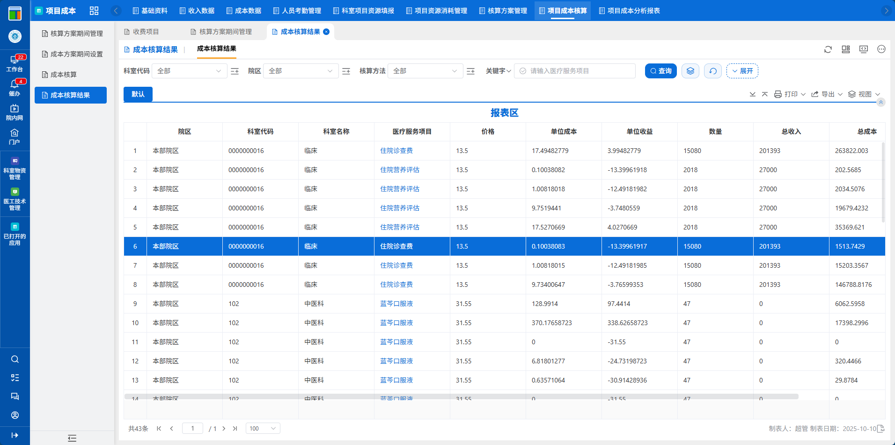
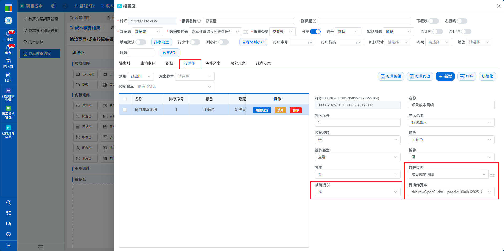
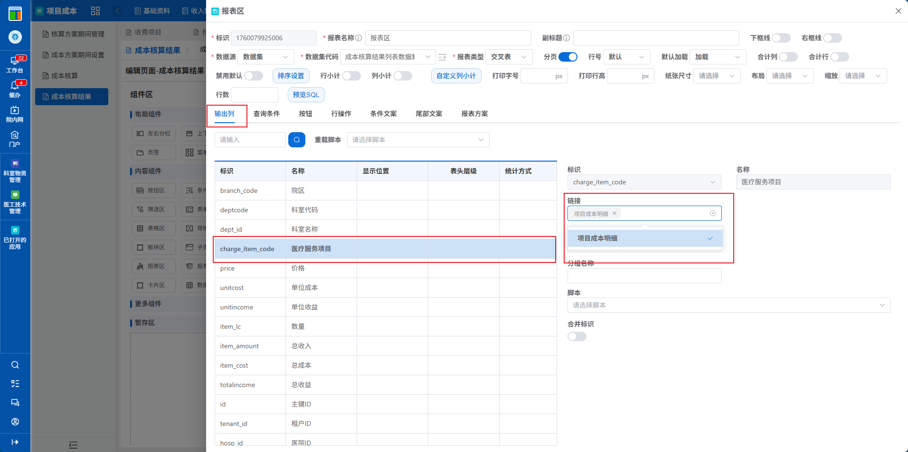

# 02.普通报表配置下钻方法

:::tip[报表下钻配置]
从一张报表转到一张子报表中
:::

## 一、需求说明

从下面报表中，点击医疗服务项目名称，进入另一张报表中




##  二、配置步骤

### 1. 打开页面设计器

注意红框中的配置项

- 配置按钮动作



- 将列头绑定按钮



### 2. 按钮脚本示例

说明：将行内字段 charge_item_code 带到另一张报表中的条件 service_item_name 上。

```javascript
this.rowOpenClick({
    pageid: '0000120251010090147LE71CL7R',
    config: {
        grid: {
            charge_item_code: 'service_item_name'
        }
    }
})
```

### 3. 注意事项

- 被打开的子报表，必须配置为新页签打开