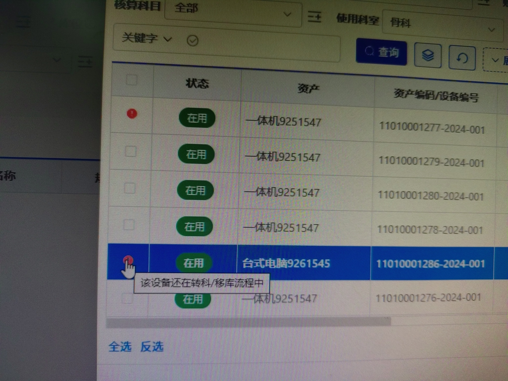

# 多选时禁止选中行设置

##  问题背景

需求背景：近期发现，老师做完转科，设备还在转科/移库流程中，但是老师忘记了，又去新增新的转科/移库单子，导致批量添加设备的时候搜不到，以为程序出现了问题

## 解决方案

数据集 新增了 两个输出列（列表隐藏） `not_selectable` 不可选择标志 `not_selectable_cause` 不可选择原因

## 效果图

## 常见用法

1. 配置在选择器中（审批编号：202502111613000156393）
2. 配置在穿梭区中（审批编号：202506041034000443350）