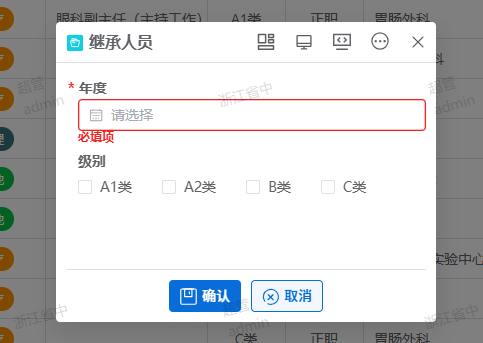

# 打开一个小弹窗

在一些业务场景中，除了新增、编辑、删除之后，会有一些其他的业务操作。需要打开弹窗，让用户输入一些数据之后，点一个保存按钮，调一个后端接口。



## 1. 打开弹窗
 
脚本：

```js
this.openClick({
    title:'继承人员', 
    config:{}
})
``` 


## 2. 弹窗中界面中的保存按钮

获得数据，并调用后端接口。
 
脚本：

```js
const thisYear = this.getConditionVal({
    col: 'year_lv',
    gid: '000120241108090619II87VVXX'
});
const year = this.getFormVal({ col: 'year_lv', formid: "1731468579363" })
const levels = this.getFormVal({ col: "level_flag_param", formid: "1731468579363" })
const levelParam = levels.split(',')
window.http.post('/a0/hr/hr-job-report/inheritUser', {
    data: {
        year: year,
        thisYear: thisYear,
        levelParam: levelParam
    }
}).then(res => {
    if (res.data.code === 200) {
        window.message.pc.success("继承成功！");
        this.reloadGrid({ gid: '000120241108090619II87VVXX' });
        this.cancel({ gid: '000120241108090619II87VVXX' });
    }
});
``` 

## 3. 接口调用成功后关闭弹窗

需要指定表格ID，这个ID为这个弹窗发起按钮所在的表格的ID。

```js
this.cancel({ gid: '000120241108090619II87VVXX' });
```
 

 ## 4. 刷新表格

```js
this.reloadGrid({ gid: '000120241108090619II87VVXX' });
```
