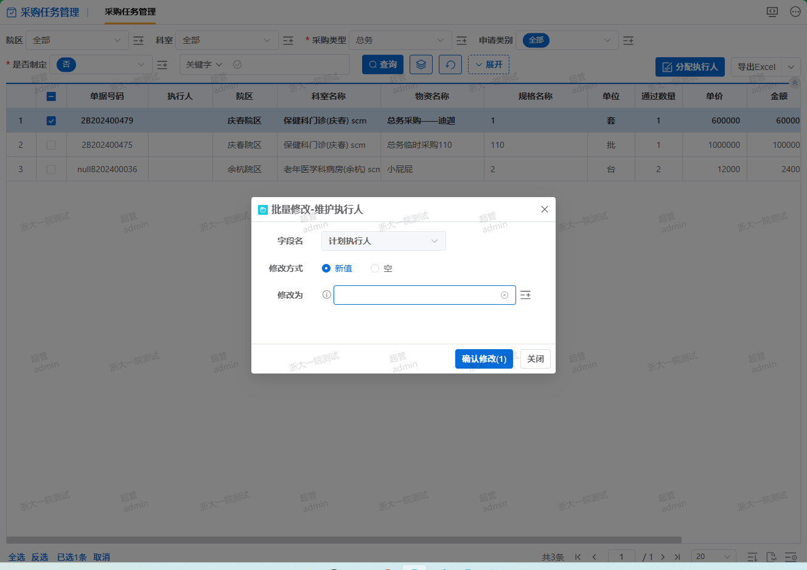

# 批量修改功能

批量修改某些字段值的功能




## 1. 按钮脚本
 
 
```js
this.batchUpdateClick({
    title: "维护执行人", //弹窗标题
    type: "single", //修改单个字段or多个字段
    config: 'executor', // 指定修改的某个字段，不传默认修改所有
    updateType: "1", //修改方式 3或者不传默认不修改，2为清空（必填字段不可传3），1为默认打开定位到修改为新增，
    relationTable: "0", //不传或者为0，弹窗中隐藏'更新'字段,为不更新，传1显示'更新'字段，且可修改更新字段的值
})
``` 

## 2. 扩展记录

### 用户需求(过滤下拉控件中的数据)

- 日期：20241203
- 内容：修改计划执行人时，下拉控件中的人员，要按采购类型来过滤。
- 方案

    增加配置项：`datasetParam`，在下拉框调取数据集时，多传自定义的参数。

    ```js
    const RECEIPT_TYPE = this.getConditionVal({ col: 'RECEIPT_TYPE', gid: '189265664660' });
    this.batchUpdateClick({
        title: "维护执行人",
        type: "single", 
        config: 'executor',
        updateType: "1",
        relationTable: "0",
        datasetParam: [{ name: "RECEIPT_TYPE", type: "String", defaultValue: RECEIPT_TYPE }]
    })
    ```

## 3. 实际问题


### 3.1 问题描述

这个批量修改，我是写的不对吗；咋不行呀


### 3.2 问题排查
 
批量修改功能的前置条件：

1. 配置了表格区的明细页面（表单）
2. 表单中的表字段要设置批量更新标记


 ### 3.3 按条件判断是否允许批量修改

```js
const rows = this.getGridSelectedRows({ gid: '000120250325093717CITD5LIQ' });
if (rows.length > 0) {
    const arrN = [];
    let flag = true;
    for (let i = 0; i < rows.length; i++) {
        const row = rows[i];
        if (row.fl_activity_id !== 'Activity_16k6o12') {
            flag = false;
            arrN.push('工号：' + row.user_code + '，姓名：' + row.user_name);
        }
    }

    if (flag) {
        this.batchUpdateClick({
            title: "党委会考核结果",
            type: "single",
            updateType: "1",
            relationTable: "1",
            config: "party_committee_comments_result"
        })
    } else {
        window.message.pcbox({
            title: '提示',
            message: arrN.join('、') + '无法修改，请选择处于待党支部审核状态的行'
        });
    }

} else {
    message.pc.info('请选择一条数据')
}
```