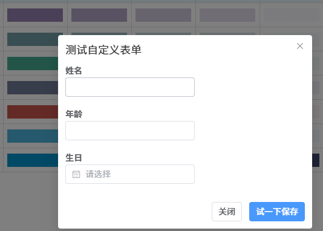
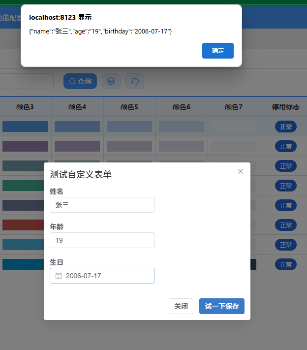

# 08.打开自定义表单

:::danger[工单：202506100838000077363]
类似关联工单这种，配置一个按钮，加一个动态弹窗 ，弹窗页面显示的内容可以便捷定义（不用选表）
:::


## 函数名

| 函数名 | 功能 |
| ---- | ---- |
| openCustomForm | 按钮上使用 |


## 示例

```js
this.openCustomForm({
  title:'测试自定义表单',
  columns: [
    { name: 'name', label: '姓名', control: 'text' },
    { name: 'age', label: '年龄', control: 'text' },
    { name: 'birthday', label: '生日', control: 'date' },
  ],
  confirmButtonText: '试一下保存', 
  confirmClick:(formdata, done)=>{
    alert(JSON.stringify(formdata));

    // 模拟请示,2秒后关闭
    setTimeout(()=>{
      done();
    }, 2000)
    
  }
})
```




 